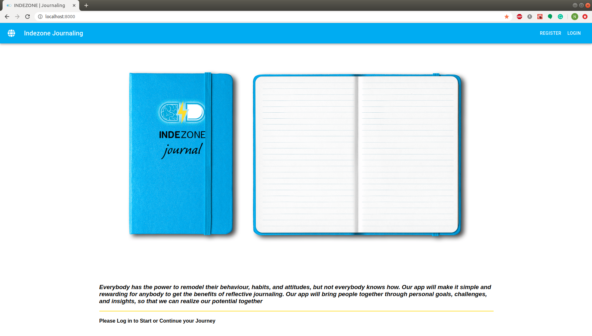
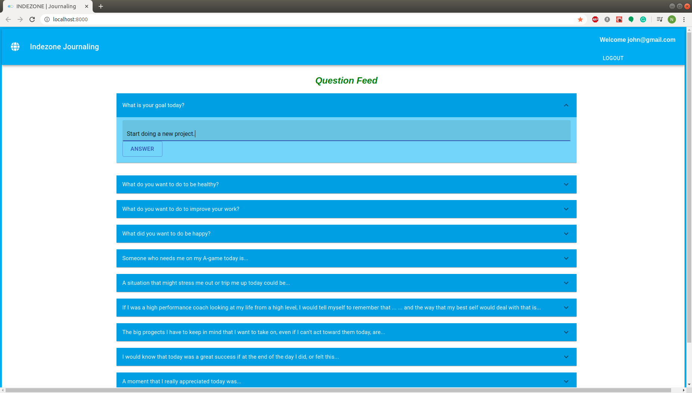
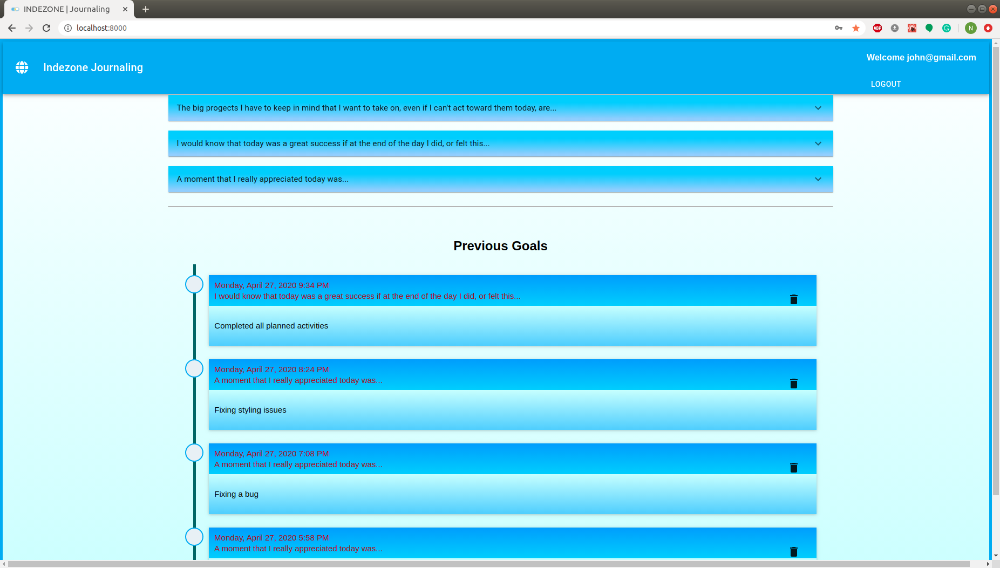
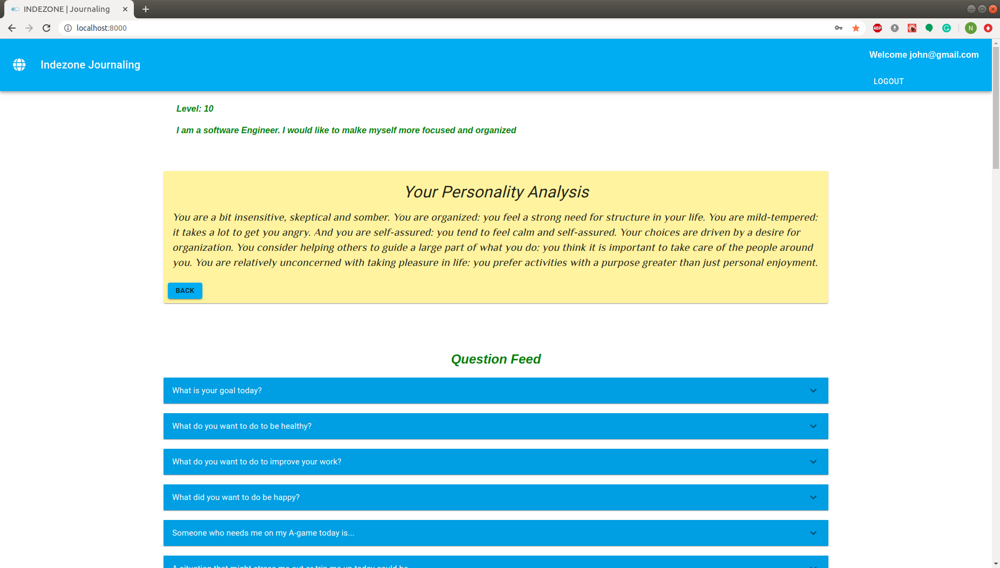
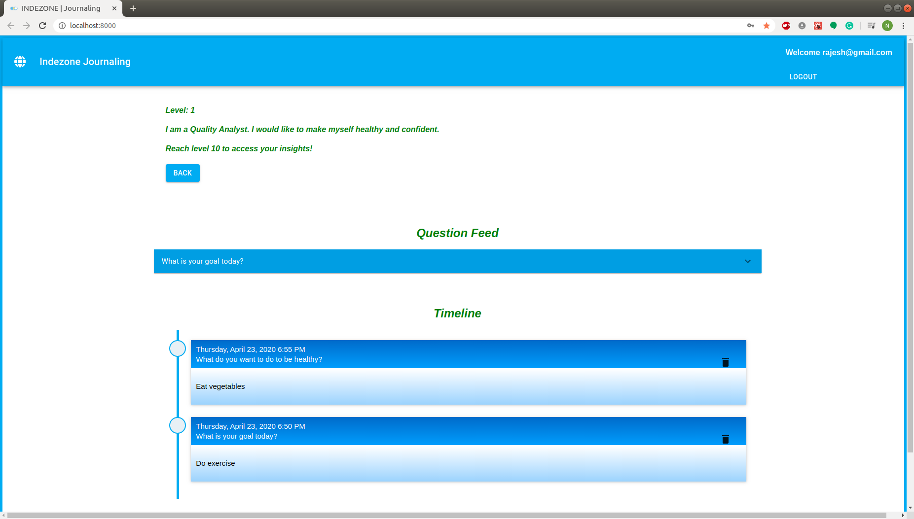

# Indezone Journal
A.I.—powered journaling app to make it easy for anyone to start journaling and get objective insights to get the most out of life

## Contributors

[Neethu M S](https://github.com/neethu-ms) -- [Altair Ioffe](https://github.com/altairioffe) -- [Lucas Cekan](https://github.com/CekanLucas)

## Setup Express and React using the following link

  <https://daveceddia.com/create-react-app-express-backend/>

## Features

1. User will be provided with questions based on their level. If user is at level 1, user will have 1 question, if at level 2, there will be 2 questions and it goes on. Once the user reaches level 15, then number of questions are limited to 15 for higher levels.
2. When user answers a question, it will be added to his timeline immediately.
3. If user is at level 10 or higher, he will be able to see his insights, which is based on the analysis of his previous entries using IBM watson API.
4. Level is computed based on points. For each word, 1 point will be added. If user deletes an entry, the points will be reduced. All users start with level 1. Once user earns 20 points, will reach level 2, 30 points will lead to level 3 and it continues till level 10.
5. Once user reaches level 10, needs to earn 100 more points to reach level 11 and the same procedure continues to proceed to next levels.

## Final Product

---

---

---

---

## Dependencies

   1. React
   2. Express
   3. axios
   4. saas
   5. Nodemon
   6. sequelize
   7. sequelize-cli
   8. pg
   9. ibm-watson
   10. personality-text-summary
   11. react-event-timeline
   12. Material-UI
   13. bcrypt
   14. cookie-session
   15. Node version 12

## Design tools

  1.ERD and wire frame -  <https://www.lucidchart.com/>
